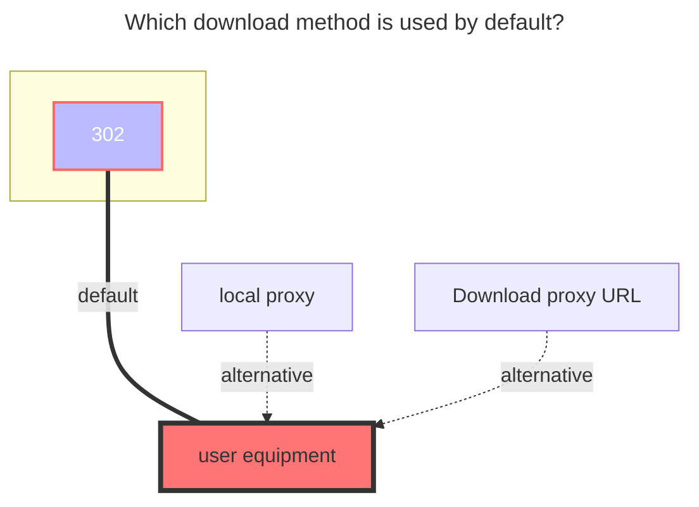

# GuangYaPan

`GuangYaPan` uses a two-step SMS login flow. Save once to send the SMS code, then save again with the SMS code to finish login.

## Add Method

1. Open the AList admin panel, go to `Storage`, and click `Add`.

2. Select `GuangYaPan` as the `Driver`, then fill in the mount path in `Mount path`.

3. Fill in `Phone number`, for example: `+86 13800000000`.

4. If the page requires `captcha_token`, complete the captcha verification first, then fill in `Captcha`.

5. Enable `Send code`, then click `Add` or `Save`. AList will send an SMS code to the phone number and automatically generate `Verify id`.

6. Return to the storage list. If the status shows `SMS sent successfully. Please fill verify_code and save to complete login.`, click `Edit` for this storage.

7. Fill the received SMS code into `Verify code`, then save again. After the save succeeds, AList completes login and stores the access token automatically.

:::warning
`Verify id` is generated automatically after the SMS code is sent. Do not edit it manually.

`Access token` and `Refresh token` are generated and saved automatically after login. If the token expires or account status changes, repeat the SMS login flow above.
:::

## Config

### Phone number

Phone number used for SMS login. For mainland China numbers, use the `+86` country code format.

### Captcha

Captcha or `captcha_token`. Fill it only when the page requires it.

### Send code

Set it to `true` and save to send the SMS code. It is reset to `false` automatically after the SMS code is sent.

### Verify code

SMS code received on the phone. After sending the SMS code, edit the storage, fill this field, and save again to finish login.

### Verify id

Generated automatically after sending the SMS code. Do not edit it manually.

### Access token / Refresh token

Generated and saved automatically after login. Usually no manual input is needed.

## The Default Download Method Used

