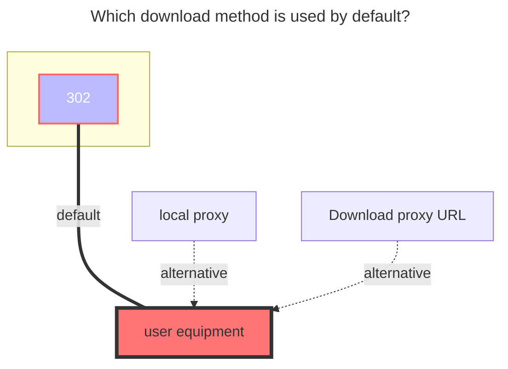

# MediaFire

:::tip
Supported version:

- MediaFire driver and automatic session renewal: `>= v3.53.0`
:::

 

Site：**https://mediafire.com**
 

- MediaFire does not provide `API_KEY` nor `APP` support anymore, so setting user session values is a must.

## **Configure storage**

1. Go **http://localhost:5244/@manage/storages** or your custom AList web
2. Press "Add" button to bind another storage
3. Choose "MediaFire"
4. Set Mount Path, i.e. /MediaFire/MyCloud
5. Go **https://mediafire.com** in another browser tab
6. Open Dev Tools by pressing F12 or (Ctrl / Command) + Shift + I
7. Press "Network" tab (upper bar)
8. Press F5 to refresh and start intercepting all requests

9. Copy the `Session Token`

   

10. Switch tab to AList Admin and Paste it into Session Token field

11. Switch tab to MediaFire and Copy the `Cookie`

    

12. Switch back tab to AList Admin and Paste it into Cookie field

13. Verify Session Token and Cookie are set

    

 

14. Press "Add" button again to confirm your MediaFire storage. Done!

 

## **Root folder ID**

Default is "/", because this driver roots to "myfiles", and then manages directories to folderID like "xxxyyyzzz123".

- Custom folder root is currently not supported since MediaFire dir structure is based in IDs, not in sequential navigation i.e. /myfiles/Photos/Christmas/

 

### **Features**

1. List, Link, MakeDir, Move, Rename, Copy, Remove, Put, PutResult

2. Session token auto-renewal while the storage stays active

3. Upload is chunked, resumable, and supports recovery. Very useful for big files.

 

### **Tips**

1. `root folder ID`,`root folder Path` will be set automatically

2. MediaFire sessions are short-lived. AList renews the session token in the background every few minutes while the storage stays online, so long-running instances usually keep working without manual refresh.

3. If AList is restarted, sleeps for a long time, or MediaFire revokes the login, you may still need to capture a fresh `Session Token` and `Cookie`.

4. `Chunk size` controls the per-chunk upload size used by the MediaFire uploader. Larger values reduce the number of requests, but unstable networks may benefit from smaller chunks.

 

### **The default download method used**

