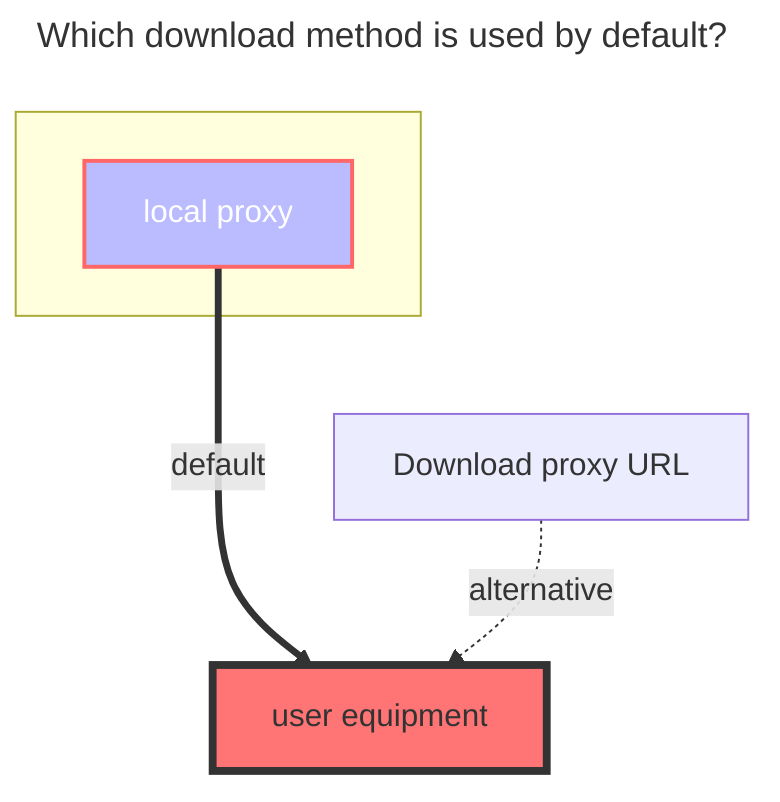
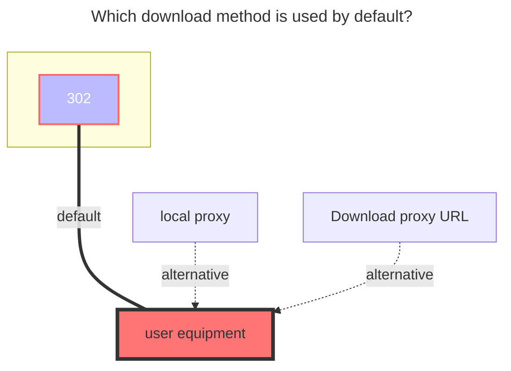

---
# This is the icon of the page
icon: iconfont icon-state
# This control sidebar order
order: 151
# A page can have multiple categories
category:
  - Guide
# A page can have multiple tags
tag:
  - Storage
  - Guide
  - "Native Rroxy"
  - "302"
# this page is sticky in article list
sticky: true
# this page will appear in starred articles
star: true
---

# Thunder Cloud Disk

:::tip
Please use Thunder directly instead of ThunderExpert if you are not good at it.

ThunderExpert mainly provides more free settings and realizes more login methods

-----

Thunder X serves overseas users. As of the time of document release, only the Android version is available. Other versions have not yet been released.

- Thunder X has sufficient speed even without membership. Future changes are unknown.
- Using the APP may require a proxy, but not when mounted on AList.

-----

Thunder Browser：Currently only supports mobile phones (Android, iOS)

- **https://x.xunlei.com/**
- If you log in to AList, the mobile phone will be kicked offline. On the contrary, if you log in to AList first and then log in to the mobile phone, AList will be kicked offline but there will be no prompt

:::


:::: tabs#thunder

@tab Thunder

### **username**

That is, the mobile phone number, email, and username used for login (there is a probability that you cannot log in, you need to try)

- For phone numbers, try the 11-digit number first. If login fails, try adding the `+86` area code, for example `+86 13722223333`.

<br/>


### **password**

password for login

<br/>


### **CaptchaToken / CreditKey / DeviceID**

`CaptchaToken` usually does not need to be filled manually. If `need verify: {url}` appears when logging in or uploading, open the link in the error and complete the verification. The driver will save the new `CaptchaToken` automatically.

`DeviceID` can usually be left empty. The driver will generate and save one automatically. If login verification is triggered, keep the same `DeviceID` before retrying; changing it frequently may make the verification result unusable.

`CreditKey` is only used when login verification is triggered. If the following prompt appears when adding the driver, login verification has been triggered:


### **Login verification solution**

Use a computer if possible.

Copy the complete data in the box, from the first `{` to the last `}`, for example:

```json
{
  "creditkey": "",
  "reviewurl": "",
  "deviceid": "",
  "devicesign": ""
}
```

Open this site:

`https://i.xunlei.com/xlcaptcha/android.html`


The image above shows the initial page. This captcha is unrelated to the verification required by the mount.

Open the browser console (F12), enter `reviewCb(the copied data as the parameter)`, and press Enter. Example:

```js
reviewCb({
  "creditkey": "",
  "reviewurl": "",
  "deviceid": "",
  "devicesign": ""
})
```

Then the page will change to SMS verification or smart detection:


Complete the SMS verification. The smart detection page does not need to be completed. It will not redirect back to AList, and clicking the confirm button may not show any prompt.

Copy `creditkey` from the console, fill it into the driver's `CreditKey` field, then save the driver configuration.


<br/>


### **The default download method used**




@tab ThunderExpert

:::tip
If Xunlei needs to download, you must specify UserAgent (same as DownUserAgent below)
Or use the proxy function in this program to transfer.
:::

### **Login Type**

1. When selecting User, you only need to fill in the username and password
   - For phone numbers, try the 11-digit number first. If login fails, try adding the `+86` area code, for example `+86 13722223333`.


2. **RefreshToken**: Just fill in RefreshToken when selecting RefreshToken

<br/>


### **Signature Type**

**Algorithms**: When selecting Algorithms, fill in Algorithms. The default value has been updated to the parameters built into the current driver, so normally keep the default.

**Captcha sign**: Only fill in CaptchaSign and Timestamp when selecting CaptchaSign

```
//signature algorithm
str = ClientID + ClientVersion + PackageName + DeviceID + Timestamp
for (Algorithm in Algorithms) {
    str = md5(str + Algorithm)
}
CaptchaSign = "1." + str
```

Login type and Sign type recommended options


<br/>


### **DeviceID**

Used to identify the login device. If left empty, the driver will generate and save one automatically. If login verification is triggered, keep the same `DeviceID` and retry.

### **ClientID, ClientSecret, ClientVersion, PackageName**

These values are related to signing and login. The defaults have been updated to:

- `ClientID`: `Xp6vsxz_7IYVw2BB`
- `ClientSecret`: `Xp6vsy4tN9toTVdMSpomVdXpRmES`
- `ClientVersion`: `8.31.0.9726`
- `PackageName`: `com.xunlei.downloadprovider`

Normally keep the defaults.

### **UserAgent**

UserAgent used by API requests. Incorrect values may cause access failure or speed limits. The default has been updated to `ANDROID-com.xunlei.downloadprovider/8.31.0.9726 ... sdkVersion/512000 ...`.

### **DownUserAgent**

The User Agent used for downloading. Incorrect values may cause download failures or abnormal speed (used when proxy is enabled). Default:

`Dalvik/2.1.0 (Linux; U; Android 12; M2004J7AC Build/SP1A.210812.016)`

### **CreditKey**

Only used when login verification is triggered. Use the same handling steps as [CaptchaToken / CreditKey / DeviceID](#captchatoken--creditkey--deviceid). After a successful login, the driver clears this field.

<br/>


## **Key data acquisition process**

After PR [#8342](https://github.com/AlistGo/alist/pull/8342), username/password login for `Thunder` and `ThunderExpert` was changed:

1. The driver first calls `https://xluser-ssl.xunlei.com/xluser.core.login/v3/login` to get `sessionID`.
2. It then calls `https://xluser-ssl.xunlei.com/v1/auth/signin/token` to exchange the token used by AList.
3. Login parameters were updated to Xunlei Android client `8.31.0.9726` and `sdkVersion/512000`.
4. A `CreditKey` field was added for login verification.
5. The normal `Thunder` driver can also customize `DeviceID`.

Therefore, the old process of capturing `v1/shield/captcha/init` and `v1/auth/token` to obtain `CaptchaSign`, `Timestamp`, `RefreshToken`, and related fields is outdated. Prefer the normal `Thunder` driver and only fill in username and password. Use `ThunderExpert` only when advanced parameters or custom UserAgent are needed.

<br/>


### **ThunderExpert complete parameter filling demo:**

 

<br/>


### **The default download method used**




@tab Thunder  X

### **username、password**

The mailbox and password used for login

<br/>


### **CaptchaToken**

It will be filled automatically without filling in manually

<br/>


### **Root folder id**

The default is the full directory of the empty display, If you want to use a subfolder to make the root directory, grab the request to get it

- In the request in the package`https://api-pan.xunleix.com/drive/v1/files?parent_id=&page_token=&filters=`，you can get the following parameters
  - `文件夹ID（id）`
  - `文件夹名称（name）`
  - `父文件夹ID（parent_id）`
- The `folder ID` obtained in the root directory (for example : `我接收的文件`、`我的云盘`、`高速云下载`), **This will change with different account numbers, there is no the same value, In the request in the package**


<br/>

### **Use video url**

- **https://github.com/alist-org/alist/pull/6464#issuecomment-2124306443**

<br/>


### **The default download method used**


@tab Thunder  X Expert

### **username、password**

The mailbox and password used for login

<br/>


### **CaptchaToken**

It will be filled automatically without filling in manually

<br/>


### **Root folder id**

The default is the full directory of the empty display, If you want to use a subfolder to make the root directory, grab the request to get it

- In the request in the package`https://api-pan.xunleix.com/drive/v1/files?parent_id=&page_token=&filters=`，you can get the following parameters
  - `文件夹ID（id）`
  - `文件夹名称（name）`
  - `父文件夹ID（parent_id）`
- The `folder ID` obtained in the root directory (for example : `我接收的文件`、`我的云盘`、`高速云下载`), **This will change with different account numbers, there is no the same value, In the request in the package**


<br/>


### **Login Type**

- ` User `: Only fill in the username and password

- ` Refresh token `: Just fill in`RefreshToken`

<br/>


### **Sign Type**

- `Algorithms`：Choose `Algorithms` Just fill in `Algorithms` (It has been automatically filled. You do n’t have to fill in it yourself. You only need to fill in the username and password.When the algorithm is not invalidated)
- `Captcha sign`: Choose `Captcha sign` Just fill in `Captcha sign` and `Timestamp`

<br/>


### **Part of parameter Packet Capture description**

- `Captcha token` ：No need to fill in
- `Device id`：The value calculated by MD5 is used to judge the login device
- `Client id`, `Client secret`, `Client version`, `Package name`：It related to the signature, fill in according to the actual situation

-----

- `User agent`：API requests `User agent`, setting errors may not access or speed limit
- `Download user agent`：When downloading, use the `user agent `,If the setting error cannot be downloaded (the agent will use it)
  - `User agent` and `Download user agent`：You can fill it out by yourself. If you don’t know how to fill it out, you can leave it blank and it will be automatically filled in.


-----

In the request in the package `https://xluser-ssl.xunleix.com/v1/shield/captcha/init`，you can get the following parameters^6^

- `Client id`、`Device id`、`Captcha sign`
- `Package name`、`Client version`、`Timestamp`


In the request in the package `https://xluser-ssl.xunleix.com/v1/auth/signin`, you can get the following parameters^2^

  - `Client id`、`Client secret`


<br/>


### **Use video url**

- **https://github.com/alist-org/alist/pull/6464#issuecomment-2124306443**

<br/>


### **The default download method used**


@tab Thunder  Browser

### **username、password**

Mobile phone number, email, username, and password used to log in

- When filling in the mobile phone number, please bring the `+86` area code, for example `+86 13822334455`

<br/>


### **CaptchaToken**

It will be filled automatically without filling in manually

<br/>


### **Root folder id**

The default is the full directory of the empty display, If you want to use a subfolder to make the root directory, grab the request to get it

- In the request in the package`https://x-api-pan.xunlei.com/drive/v1/files?parent_id&page_token&space=`，you can get the following parameters
  - `文件夹ID（id）`
  - `文件夹名称（name）`
  - `父文件夹ID（parent_id）`
- The `folder ID` obtained in the root directory (for example : `来自分享`、`超级保险箱`), **This will change with different account numbers, there is no the same value, In the request in the package**


<br/>


### **Safe password**

Thunder  Browser Safe password

- Files in Safe password can only be deleted directly and cannot be deleted to the recycle bin, so the [**Deletion method**](#remove-way) below has nothing to do with this configuration.

<br/>


### **Remove way**

**Trash**：Use AList to delete files and then move them to the Recycle Bin. If you delete them accidentally, you can restore them through Thunder Cloud Disk.

**Delete**：Deleting it directly cannot restore it.

<br/>


### **Use video url**

- When `Use video url` is turned on, some types of files may not be accessible properly.
- **https://github.com/alist-org/alist/pull/6464#issuecomment-2124306443**

<br/>


### **The default download method used**


@tab Thunder Browser Expert

### **username、password**

Mobile phone number, email, username, and password used to log in

- When filling in the mobile phone number, please bring the `+86` area code, for example `+86 13822334455`

<br/>


### **CaptchaToken**

It will be filled automatically without filling in manually

<br/>


### **Root folder id**

The default is the full directory of the empty display, If you want to use a subfolder to make the root directory, grab the request to get it

- In the request in the package`https://x-api-pan.xunlei.com/drive/v1/files?parent_id&page_token&space=`，you can get the following parameters
  - `文件夹ID（id）`
  - `文件夹名称（name）`
  - `父文件夹ID（parent_id）`
- The `folder ID` obtained in the root directory (for example : `来自分享`、`超级保险箱`), **This will change with different account numbers, there is no the same value, In the request in the package**


<br/>


### **Safe password**

Thunder  Browser Safe password

- Files in Safe password can only be deleted directly and cannot be deleted to the recycle bin, so the [**Deletion method**](#remove-way-1) below has nothing to do with this configuration.

<br/>


### **Remove way**

**Trash**：Use AList to delete files and then move them to the Recycle Bin. If you delete them accidentally, you can restore them through Thunder Cloud

**Delete**：Deleting it directly cannot restore it.

<br/>


### **Login Type**

- ` User `: Only fill in the username and password

- ` Refresh token `: Just fill in`RefreshToken`

<br/>


### **Sign Type**

- `Algorithms`：Choose `Algorithms` Just fill in `Algorithms` (It has been automatically filled. You do n’t have to fill in it yourself. You only need to fill in the username and password.When the algorithm is not invalidated)
- `Captcha sign`: Choose `Captcha sign` Just fill in `Captcha sign` and `Timestamp`

<br/>


### **Part of parameter Packet Capture description**

- `Captcha token` ：No need to fill in
- `Device id`：The value calculated by MD5 is used to judge the login device
- `Client id`, `Client secret`, `Client version`, `Package name`：It related to the signature, fill in according to the actual situation

-----

- `User agent`：API requests `User agent`, setting errors may not access or speed limit
- `Download user agent`：When downloading, use the `user agent `,If the setting error cannot be downloaded (the agent will use it) 
  - `User agent` and `Download user agent`：You can fill it out by yourself. If you don’t know how to fill it out, you can leave it blank and it will be automatically filled in.

-----

In the request in the package `https://xluser-ssl.xunlei.com/v1/shield/captcha/init`，you can get the following parameters^6个^

- `Client id`、`Device id`、`Captcha sign`

- `Package name`、`Client version`、`Timestamp`


In the request in the package `https://xluser-ssl.xunlei.com/v1/auth/signin/token`, you can get the following parameters^3^

  - `Client id`、`Client secret`、`Refresh token`


<br/>


### **Use video url**

- Open `Use video url` 可能会遇到部分类型的文件无法正常访问
- **https://github.com/alist-org/alist/pull/6464#issuecomment-2124306443**

<br/>


### **The default download method used**


::::
