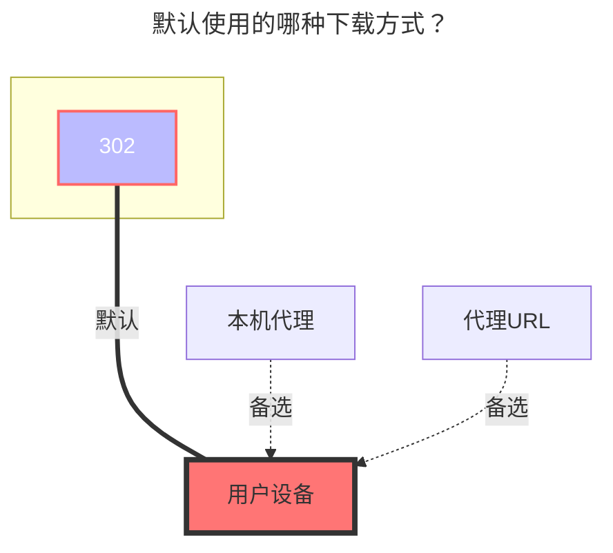

# GuangYaPan（光鸭网盘）

`GuangYaPan` 使用两阶段短信登录。第一次保存用于发送短信验证码，第二次保存用于提交短信验证码并完成登录。

## 添加方式

1. 进入 AList 管理后台，打开 `存储`，点击 `添加`。

2. 在 `驱动` 中选择 `GuangYaPan`，填写要挂载到 AList 的 `显示文件夹名称`。

3. 填写 `电话号码`，格式示例：`+86 13800000000`。

4. 如果页面要求 `captcha_token`，先按提示完成验证码校验，再填写 `验证码`。

5. 打开 `发送代码` 开关，然后点击 `新增` 或 `保存`。保存后 AList 会向该手机号发送短信验证码，并自动生成 `验证 id`。

6. 返回存储列表，如果状态显示 `SMS sent successfully. Please fill verify_code and save to complete login.`，点击该存储的 `编辑`。

7. 在 `验证代码` 中填写手机收到的短信验证码，然后再次保存。保存成功后会自动登录，并自动保存访问令牌。

:::warning
`验证 id` 会在发送短信验证码后自动生成，不要手动修改。

`访问令牌` 和 `刷新令牌` 会在登录成功后自动保存；如果令牌过期或账号状态变化导致无法访问，按上面的步骤重新发送短信验证码并保存即可。
:::

## 配置项

### 电话号码

短信登录使用的手机号。中国大陆手机号建议使用 `+86` 国际区号格式。

### 验证码

图形验证码或 `captcha_token`。只有页面提示需要时才填写。

### 发送代码

设置为 `true` 并保存后，AList 会发送短信验证码；发送后该开关会自动恢复为 `false`。

### 验证代码

手机收到的短信验证码。发送短信验证码后，编辑该存储并填写此项，再保存即可完成登录。

### 验证 id

发送短信验证码后自动生成。不要手动编辑。

### 访问令牌 / 刷新令牌

登录成功后自动生成并保存。通常不需要手动填写。

## 默认使用的下载方式

