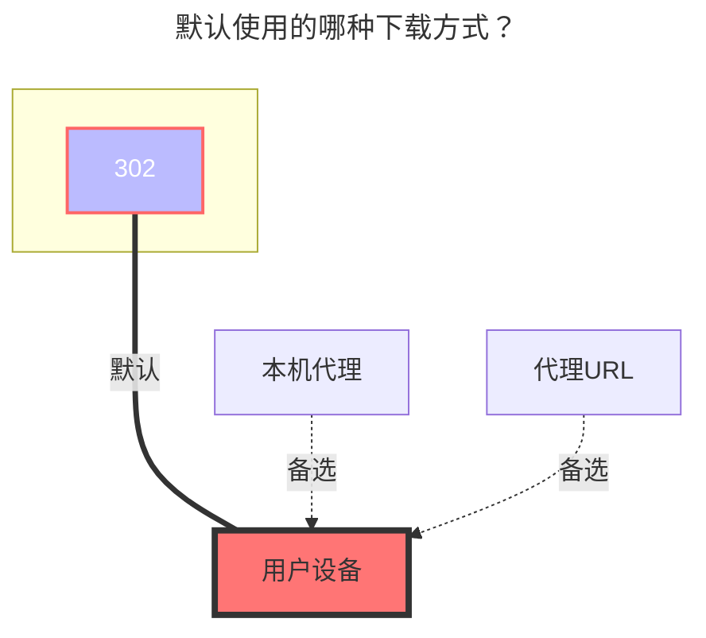

# MediaFire

:::tip
支持版本：

- MediaFire 驱动与会话自动续期：`>= v3.53.0`
:::

 

站点：**https://mediafire.com**
 

- MediaFire 目前不再提供 `API_KEY` 或 `APP` 接入方式，因此必须填写用户会话相关字段。

## **配置存储**

1. 打开 **http://localhost:5244/@manage/storages** 或你自己的 AList 管理页
2. 点击 `添加`
3. 选择 `MediaFire`
4. 填写挂载路径，例如 `/MediaFire/MyCloud`
5. 新开一个标签页访问 **https://mediafire.com**
6. 按 `F12` 或 `Ctrl / Command + Shift + I` 打开开发者工具
7. 切到上方的 `Network`
8. 按 `F5` 刷新页面，开始抓取请求
9. 复制 `Session Token`

   

10. 回到 AList 管理页，粘贴到 `Session Token`
11. 再回到 MediaFire，复制 `Cookie`

    

12. 回到 AList 管理页，粘贴到 `Cookie`
13. 确认 `Session Token` 和 `Cookie` 都已填写

    

 

14. 再点击一次 `添加` 完成存储配置

 

## **根文件夹 ID**

默认是 `/`。这个驱动的根实际上对应 MediaFire 的 `myfiles`，目录内部再按 folderID 管理，例如 `xxxyyyzzz123`。

- 当前不支持直接按 `/myfiles/Photos/Christmas/` 这样的层级路径指定自定义根目录，因为 MediaFire 的目录结构以 ID 为主。

 

### **特性**

1. 支持 `List`、`Link`、`MakeDir`、`Move`、`Rename`、`Copy`、`Remove`、`Put`、`PutResult`
2. 存储在线时会自动续期 `Session Token`
3. 上传按分块进行，支持断点续传与恢复，适合大文件

 

### **提示**

1. `根文件夹 ID` 和 `根文件夹路径` 会自动设置
2. MediaFire 会话有效期较短。AList 会在存储在线时每隔几分钟自动续期一次 `Session Token`，因此长时间运行的实例通常不需要人工频繁刷新
3. 如果 AList 重启、长时间休眠，或者 MediaFire 主动让登录失效，仍然可能需要重新抓取新的 `Session Token` 和 `Cookie`
4. `分块大小` 控制 MediaFire 上传时每个分块的大小。数值越大，请求次数越少；如果网络不稳定，较小的分块通常更稳

 

### **默认使用的下载方式**

