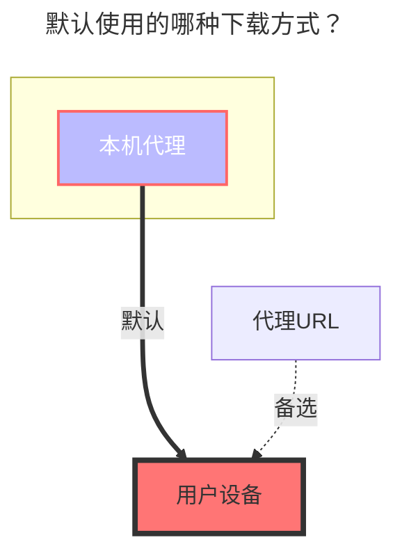
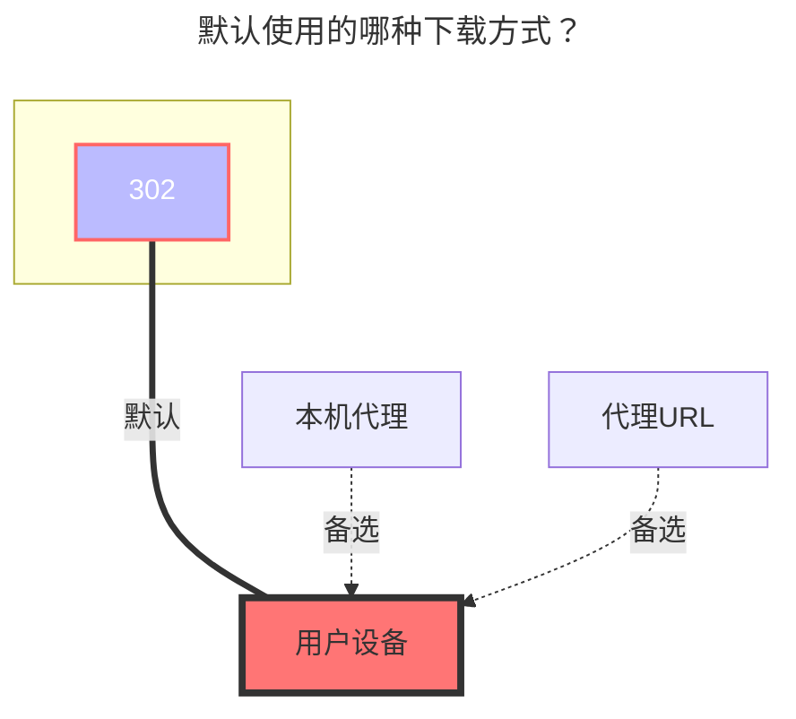

---
# This is the icon of the page
icon: iconfont icon-state
# This control sidebar order
order: 151
# A page can have multiple categories
category:
  - Guide
# A page can have multiple tags
tag:
  - Storage
  - Guide
  - "本地代理"
  - "302"
# this page is sticky in article list
sticky: true
# this page will appear in starred articles
star: true
---

# 迅雷云盘 / X / 浏览器

:::tip

迅雷 前两个是服务国内用户

小白请直接使用 迅雷不要使用 `迅雷专家版`

`迅雷专家版`主要提供更自由的设置,实现更多登录方式

-----

迅雷 X 服务海外用户，截止文档发布时只有 安卓版其它版本暂未发布

- 迅雷 X 目前未开启会员的速度也符合使用情况，后期更改暂时未知
- 使用APP可能需要 Proxy，挂载在AList不需要

-----

迅雷浏览器：目前仅支持手机端（Android、iOS）

- **https://x.xunlei.com/**
- 如果在AList登录后会将手机端踢下线，反之如果先在AList登录再登录手机，会将AList踢下线但是没有提示

:::


:::: tabs#thunder

@tab 迅雷

### **用户名**

即用于登陆的手机号,邮箱,用户名(有概率无法登录,需要尝试)

- 手机号可先直接填写 11 位手机号；如果登录失败，再尝试携带 `+86` 区号，例如 `+86 13722223333`

<br/>


### **密码**

即用于登陆的密码

<br/>


### **CaptchaToken / 信任密钥 / 设备ID**

`CaptchaToken` 一般不需要手动填写。登录或上传时如果出现 `need verify: {url}`，请打开错误中的链接完成验证，驱动会自动保存新的 `CaptchaToken`。

`设备ID` 默认留空即可，驱动会自动生成并保存。触发登录验证后，不要频繁更换 `设备ID`，否则可能导致验证结果无法复用。

`信任密钥（CreditKey）` 只在触发登录验证时使用。保存驱动时如果出现下图所示的情况，就是触发了登录验证：


### **登录验证的解决办法**

尽量使用电脑操作。

完整复制方框中的数据，从第一个 `{` 开始到最后一个 `}` 结束，例如：

```json
{
  "creditkey": "",
  "reviewurl": "",
  "deviceid": "",
  "devicesign": ""
}
```

打开下面的网站：

`https://i.xunlei.com/xlcaptcha/android.html`


上图是刚打开的样子，注意这个验证码与挂载所需的验证无关。

打开浏览器控制台（F12），输入 `reviewCb(中间的参数为之前复制的数据)` 后回车，例如：

```js
reviewCb({
  "creditkey": "",
  "reviewurl": "",
  "deviceid": "",
  "devicesign": ""
})
```

即可看到页面变成短信验证或智能检测：


完成短信验证，智能检测页面无需完成。这里不会跳转回 AList，且点击确定按钮后可能没有任何提示。

复制控制台中的 `creditkey`，并将其填回驱动配置的 `信任密钥（CreditKey）` 字段中，然后保存驱动配置。


<br/>


### **默认使用的下载方式**




@tab 迅雷专家版

:::tip
迅雷如果需要下载必须指定 UserAgent(同下 DownUserAgent)
或使用本程序中的代理功能进行中转。
:::

### **登录类型**

1. 选择 `用户名` 时填用户名和密码
   - 手机号可先直接填写 11 位手机号；如果登录失败，再尝试携带 `+86` 区号，例如 `+86 13722223333`


2. 选择 `刷新令牌`时只需填写 `刷新令牌`

<br/>


### **签名类型**

选择 `算法` 时填写 `算法`，默认值已更新为当前驱动内置参数，一般保持默认即可

选择 `验证码签名` 时只需填写 `验证码签名` 和 `时间戳`

```
//签名算法
str = ClientID + ClientVersion + PackageName + DeviceID + Timestamp
for (Algorithm in Algorithms) {
    str = md5(str + Algorithm)
}
CaptchaSign = "1." + str
```

登录类型(Login type) 和 签名类型(Sign type) 推荐选择选项


<br/>


### **设备ID**

用于判断登录设备。留空时驱动会自动生成并保存；如果触发登录验证，建议保持同一个 `设备ID` 后再重试。

### **客户端ID, 客户端秘钥, 客户端版本, 包名**

与签名和登录有关。默认值已更新为：

- `客户端ID`：`Xp6vsxz_7IYVw2BB`
- `客户端秘钥`：`Xp6vsy4tN9toTVdMSpomVdXpRmES`
- `客户端版本`：`8.31.0.9726`
- `包名`：`com.xunlei.downloadprovider`

一般保持默认即可。

### **用户代理**

API 请求使用的 UserAgent，设置错误可能无法访问或限速。默认值已更新到 `ANDROID-com.xunlei.downloadprovider/8.31.0.9726 ... sdkVersion/512000 ...`。

### **下载用户代理**

下载时用到的 User Agent，如果设置错误可能无法下载或速度异常（开启代理会使用）。默认值：

`Dalvik/2.1.0 (Linux; U; Android 12; M2004J7AC Build/SP1A.210812.016)`

### **信任密钥**

仅在触发登录验证时使用，处理方法同上方 [CaptchaToken / 信任密钥 / 设备ID](#captchatoken--信任密钥--设备id)。登录成功后驱动会清空该字段。

<br/>


## **关键数据获取流程**

PR [#8342](https://github.com/AlistGo/alist/pull/8342) 后，`迅雷` 和 `迅雷专家版` 的账号密码登录流程已调整：

1. 先调用 `https://xluser-ssl.xunlei.com/xluser.core.login/v3/login` 获取 `sessionID`。
2. 再调用 `https://xluser-ssl.xunlei.com/v1/auth/signin/token` 换取 AList 使用的登录令牌。
3. 登录参数更新到迅雷 Android 客户端 `8.31.0.9726`、`sdkVersion/512000`。
4. 新增 `信任密钥（CreditKey）` 字段，用于处理登录验证。
5. `迅雷` 普通版也支持自定义 `设备ID`。

因此，旧文档中通过抓包 `v1/shield/captcha/init`、`v1/auth/token` 来获取 `CaptchaSign`、`Timestamp`、`RefreshToken` 等参数的流程已经过期。普通用户优先使用 `迅雷` 驱动，只填写用户名和密码；需要高级参数或自定义 UserAgent 时再使用 `迅雷专家版`。

<br/>


### **使用视频URL**

- **https://github.com/alist-org/alist/pull/6464#issuecomment-2124306443**

<br/>


### **迅雷专家版 完整的参数填演示图**


<br/>


### **默认使用的下载方式**



@tab 迅雷 X

::: danger

目前官方对于频繁调用接口行为会进行封号处理，请谨慎使用，后果自负。

:::

### **用户名、密码**

即用于登陆的邮箱和密码

<br/>


### **验证码**

会自动填充，不用自己填写

<br/>


### **根文件夹ID**

默认为空展示全部目录，如果想用子文件夹做根目录请抓包获取

- 抓包请求中的`https://api-pan.xunleix.com/drive/v1/files?parent_id=&page_token=&filters=`，可以得到下面参数
  - `文件夹ID（id）`
  - `文件夹名称（name）`
  - `父文件夹ID（parent_id）`
- 根目录下获取的`文件夹ID（Folder id）`（例如：`我接收的文件`、`我的云盘`、`高速云下载`），**这个会随着账号不同而变动，没有通用的值，自己抓包获取**


<br/>


### **使用视频URL**

- **https://github.com/alist-org/alist/pull/6464#issuecomment-2124306443**

<br/>


### **默认使用的下载方式**


@tab 迅雷 X 专家版

::: danger

目前官方对于频繁调用接口行为会进行封号处理，请谨慎使用，后果自负。

:::

### **用户名、密码**

即用于登陆的邮箱和密码

<br/>


### **验证码**

会自动填充，不用自己填写

<br/>


### **根文件夹ID**

默认为空展示全部目录，如果想用子文件夹做根目录请抓包获取

- 抓包请求中的`https://api-pan.xunleix.com/drive/v1/files?parent_id=&page_token=&filters=`，可以得到下面参数
  - `文件夹ID（id）`
  - `文件夹名称（name）`
  - `父文件夹ID（parent_id）`
- 根目录下获取的`文件夹ID（Folder id）`（例如：`我接收的文件`、`我的云盘`、`高速云下载`），**这个会随着账号不同而变动，没有固定一样的值，自己抓包获取**


<br/>


### **登录类型**

- `用户`：选择 `用户`时填`用户名和密码`
- `刷新令牌`：选择 `刷新令牌` 时只需填写 `刷新令牌`

<br/>


### **签名类型**

- `算法`：选择 `算法（Algorithms）` 时需填写 `算法（Algorithms）`
- `验证码签名`：选择 `验证码签名（Captcha sign）` 时只需填写 `验证码签名（Captcha sign）` 和 `时间戳（Timestamp）`

<br/>


### **部分参数抓包说明**

- `验证码` ：无需填写
- `设备id`：通过 MD5 计算的值，用于判断登录的设备
- `客户端ID`, `客户端密钥`, `客户端版本`, `包名`：与签名有关，根据实际情况填写

-----

- `用户代理`：API 请求使用的 `用户代理`，设置错误可能无法访问或限速
- `下载用户代理`：下载时用到的 `用户代理`，如果设置错误会无法下载(开启代理会使用) 
  - `用户代理` 和 `下载用户代理` 可以自己填写，如果不知道如何填写可以留空会自动填充

-----

抓包请求中的`https://xluser-ssl.xunleix.com/v1/shield/captcha/init`，可以得到下面参数^6个^

- `客户端ID（Client id）`、`设备id（Device id）`、`验证码签名（Captcha sign）`
- `包名（Package name）`、`客户端版本（Client version）`、`时间戳（Timestamp）`


抓包请求中的`https://xluser-ssl.xunleix.com/v1/auth/signin`，可以得到下面的参数^2个^

  - `客户端ID（Client id）`、`客户端密钥（Client secret）`


<br/>


### **使用视频URL**

- **https://github.com/alist-org/alist/pull/6464#issuecomment-2124306443**

<br/>


### **默认使用的下载方式**


@tab 迅雷浏览器

### **用户名、密码**

即用于登陆的手机号,邮箱,用户名，以及密码

- 填写手机号要携带 `+86` 区号，例如 `+86 13822334455`

<br/>


### **验证码**

会自动填充，不用自己填写

<br/>


### **根文件夹ID**

默认为空展示全部目录，如果想用子文件夹做根目录请抓包获取

- 抓包请求中的`https://x-api-pan.xunlei.com/drive/v1/files?parent_id&page_token&space=`，可以得到下面参数
  - `文件夹ID（id）`
  - `文件夹名称（name）`
  - `父文件夹ID（parent_id）`
- 根目录下获取的`文件夹ID（Folder id）`（例如：`来自分享`、`超级保险箱`），**这个会随着账号不同而变动，没有固定一样的值，自己抓包获取**


<br/>


### **保险箱密码**

迅雷浏览器云盘的保险箱密码

- 超级保险箱內文件只能直接删除 无法删除到回收站，所以下方[**删除方式**](#删除方式)与此配置无关

<br/>


### **删除方式**

**回收站**：在AList删除后移除到回收站，如果有误删可以通过迅雷云盘恢复

**删除**：直接删除不可以恢复找回

<br/>


### **使用视频URL**

- 开启 `视频视频URL` 可能会遇到部分类型的文件无法正常访问
- **https://github.com/alist-org/alist/pull/6464#issuecomment-2124306443**

<br/>


### **默认使用的下载方式**


@tab 迅雷浏览器专家版

### **用户名、密码**

即用于登陆的手机号,邮箱,用户名，以及密码

- 填写手机号要携带 `+86` 区号，例如 `+86 13822334455`

<br/>


### **验证码**

会自动填充，不用自己填写

<br/>


### **根文件夹ID**

默认为空展示全部目录，如果想用子文件夹做根目录请抓包获取

- 抓包请求中的`https://x-api-pan.xunlei.com/drive/v1/files?parent_id&page_token&space=`，可以得到下面参数
  - `文件夹ID（id）`
  - `文件夹名称（name）`
  - `父文件夹ID（parent_id）`
- 根目录下获取的`文件夹ID（Folder id）`（例如：`来自分享`、`超级保险箱`），**这个会随着账号不同而变动，没有固定一样的值，自己抓包获取**


<br/>


### **保险箱密码**

迅雷浏览器云盘的保险箱密码

- 超级保险箱內文件只能直接删除 无法删除到回收站，所以下方[**删除方式**](#删除方式-1)与此配置无关

<br/>


### **删除方式**

**回收站**：在AList删除后移除到回收站，如果有误删可以通过迅雷云盘恢复

**删除**：直接删除不可以恢复找回

<br/>


### **登录类型**

- `用户`：选择 `用户`时填`用户名和密码`
- `刷新令牌`：选择 `刷新令牌` 时只需填写 `刷新令牌`

<br/>


### **签名类型**

- `算法`：选择 `算法（Algorithms）` 时需填写 `算法（Algorithms）`
- `验证码签名`：选择 `验证码签名（Captcha sign）` 时只需填写 `验证码签名（Captcha sign）` 和 `时间戳（Timestamp）`

<br/>


### **部分参数抓包说明**

- `验证码` ：无需填写
- `设备id`：通过 MD5 计算的值，用于判断登录的设备
- `客户端ID`, `客户端密钥`, `客户端版本`, `包名`：与签名有关，根据实际情况填写

-----

- `用户代理`：API 请求使用的 `用户代理`，设置错误可能无法访问或限速
- `下载用户代理`：下载时用到的 `用户代理`，如果设置错误会无法下载(开启代理会使用) 
  - `用户代理` 和 `下载用户代理` 可以自己填写，如果不知道如何填写可以留空会自动填充


-----

抓包请求中的`https://xluser-ssl.xunlei.com/v1/shield/captcha/init`，可以得到下面参数^6个^

- `客户端ID（Client id）`、`设备id（Device id）`、`验证码签名（Captcha sign）`
- `包名（Package name）`、`客户端版本（Client version）`、`时间戳（Timestamp）`


抓包请求中的`https://xluser-ssl.xunlei.com/v1/auth/signin/token`，可以得到下面的参数^3个^

  - `客户端ID（Client id）`、`客户端密钥（Client secret）`、`刷新令牌（Refresh token）`


<br/>


### **使用视频URL**

- 开启 `视频视频URL` 可能会遇到部分类型的文件无法正常访问
- **https://github.com/alist-org/alist/pull/6464#issuecomment-2124306443**

<br/>


### **默认使用的下载方式**


::::
